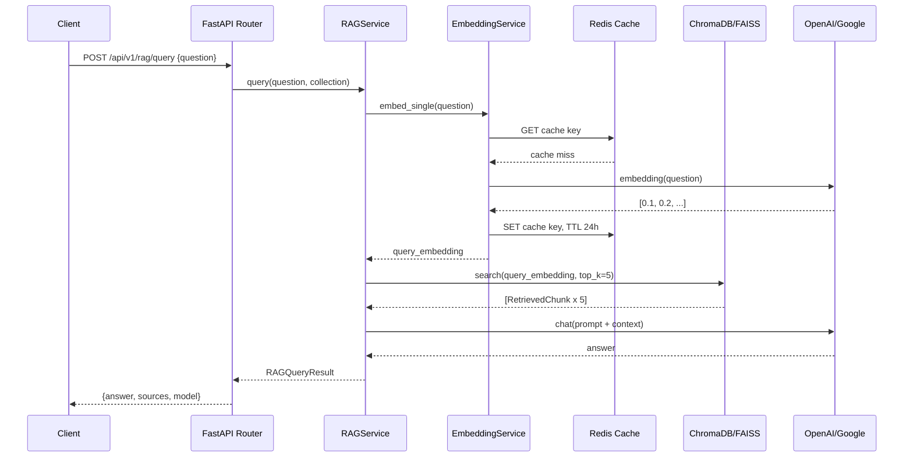
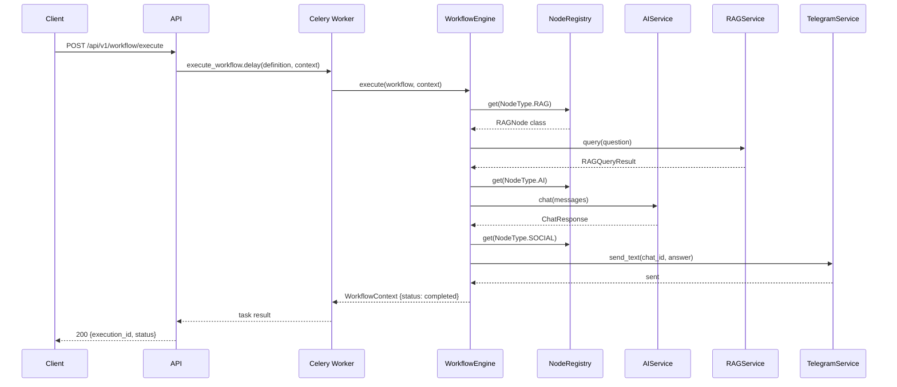
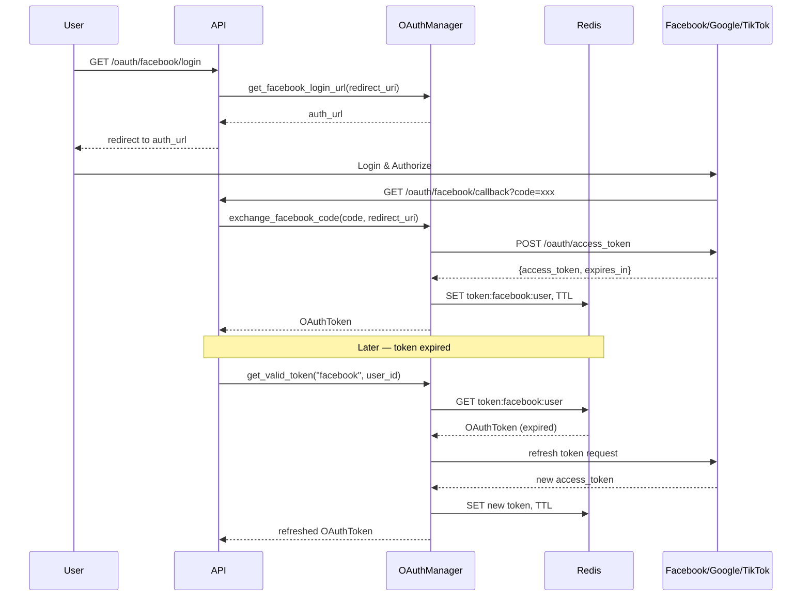
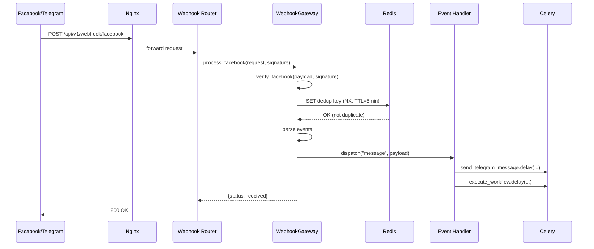
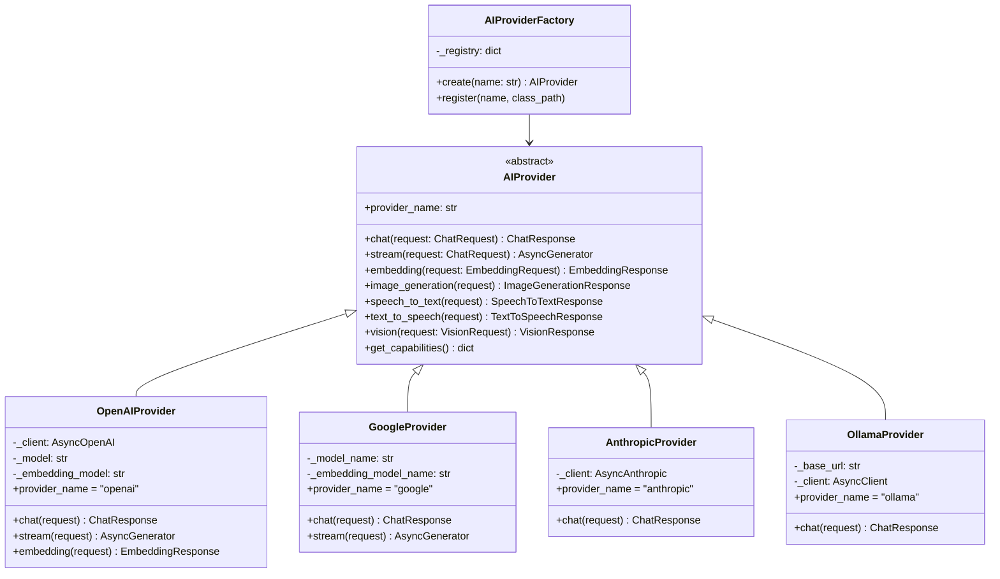
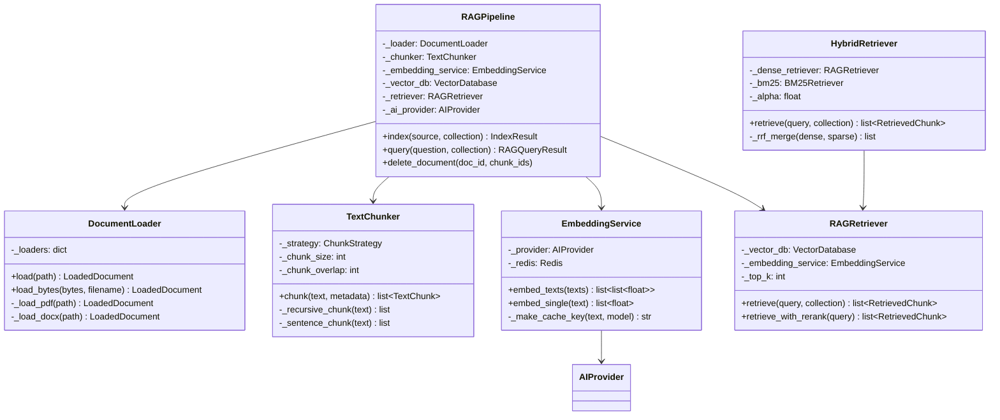
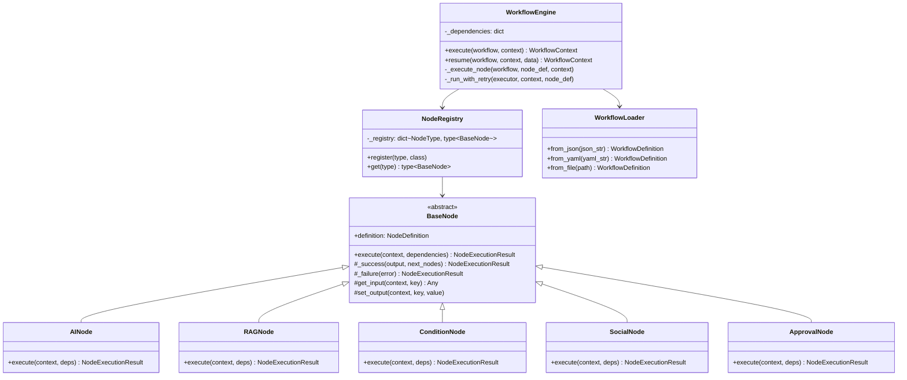
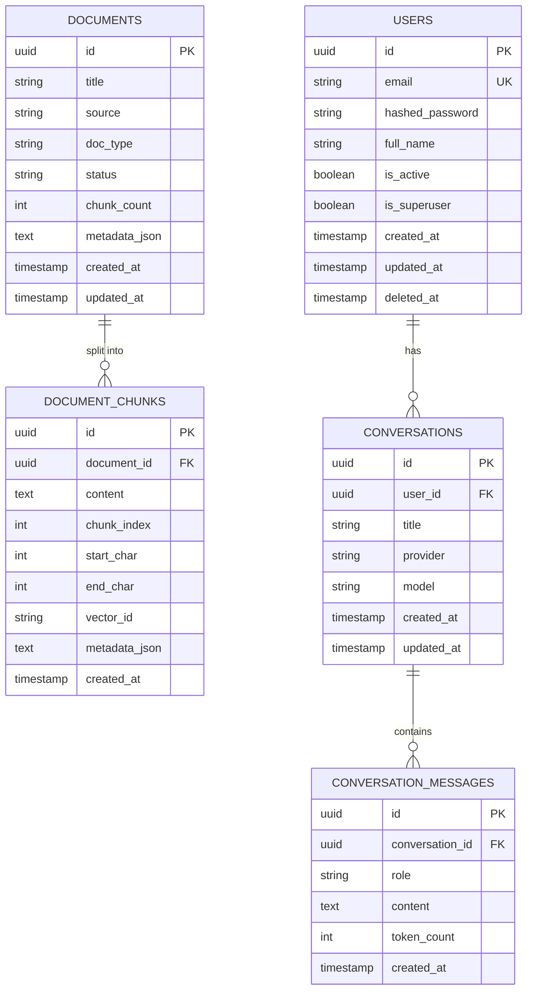
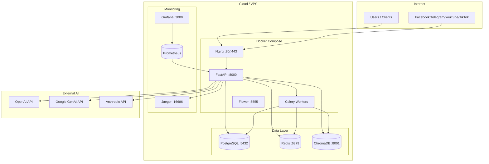

# AI Automation Platform — Architecture & Diagrams

## Table of Contents
1. [Sequence Diagrams](#sequence-diagrams)
2. [Class Diagrams](#class-diagrams)
3. [Component Diagram](#component-diagram)
4. [ER Diagram](#er-diagram)
5. [Deployment Diagram](#deployment-diagram)

---

## Sequence Diagrams

### RAG Query Flow



### Workflow Execution Flow



### OAuth2 + Auto-Refresh Flow



### Webhook Event Processing



---

## Class Diagrams

### AI Provider Hierarchy



### RAG Pipeline



### Workflow Engine



---

## Component Diagram

```mermaid
graph TB
    subgraph Client Layer
        WebApp[Web App / Mobile]
        ExternalAPI[External Services]
    end

    subgraph API Gateway
        Nginx[Nginx Reverse Proxy]
        RateLimit[Rate Limiter]
        Auth[JWT / API Key Auth]
    end

    subgraph Application Layer
        FastAPI[FastAPI App]
        subgraph Routers
            AIRouter[/ai/*]
            RAGRouter[/rag/*]
            SocialRouter[/facebook, /telegram, /youtube, /tiktok]
            WorkflowRouter[/workflow/*]
        end
        subgraph Services
            AIService[AIService]
            RAGService[RAGService]
            SocialServices[Facebook/YouTube/Telegram/TikTok Services]
            WorkflowEngine[WorkflowEngine]
        end
    end

    subgraph Provider Layer
        AIProviders[OpenAI/Google/Anthropic/Ollama]
        VectorDB[ChromaDB/FAISS]
        SocialProviders[Facebook/YouTube/Telegram/TikTok APIs]
    end

    subgraph Infrastructure
        PostgreSQL[(PostgreSQL)]
        Redis[(Redis)]
        Celery[Celery Workers]
        APScheduler[APScheduler]
    end

    WebApp --> Nginx
    ExternalAPI --> Nginx
    Nginx --> RateLimit --> Auth --> FastAPI
    FastAPI --> Routers
    Routers --> Services
    Services --> AIProviders
    Services --> VectorDB
    Services --> SocialProviders
    Services --> PostgreSQL
    Services --> Redis
    Services --> Celery
    APScheduler --> Celery
```

---

## ER Diagram



---

## Deployment Diagram


